# FreeRTOS Transplant

This document which describes the process of transplanting FreeRTOS to STM32F407VET6

| Date       | Author  | Description   |
| ---------- | ------- | ------------- |
| 11/09/2023 | Manfred | First release |

**Environment**

- OS : Windows10
- Board : STM32F407VET6
- IDE : Keil5

---

If you find or have any questions, fell free to contact me.

Email : 1259106665@qq.com / manfredxxc@gmail.com

Ref:

- [STM32F4基础工程移植FreeRTOS_图图Tuu的博客-CSDN博客](https://blog.csdn.net/q361750389/article/details/106755214)
- [FreeRTOS移植STM32超详细（以STM32F103ZE为例）_freertos移植到stm32-CSDN博客](https://blog.csdn.net/dnct55/article/details/129658030)
- [FreeRTOS在STM32F4上移植_Zach_z的博客-CSDN博客](https://blog.csdn.net/zach_z/article/details/77435898)

---

**Contents**

[TOC]

## Preparation

- [x] A pre-configured demo application that should build with no errors or warnings

  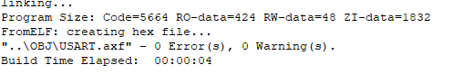

- [x] The source code of FreeRTOS

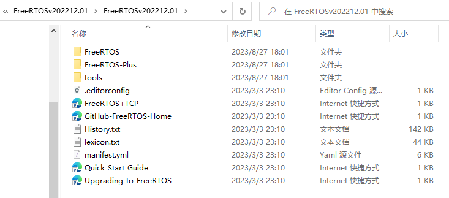

## Migrate files

**1.Create a folder named `FreeRTOS` in the demo project directory**

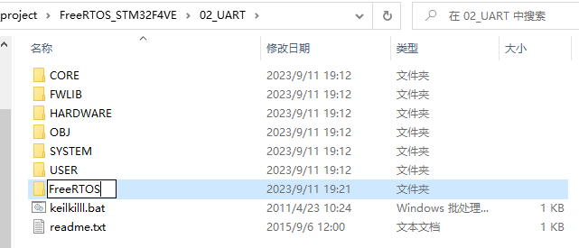

**2.Copy all the files in `FreeRTOSv2022.12.01/FreeRTOS/Source`  to current directory `FreeRTOS`**

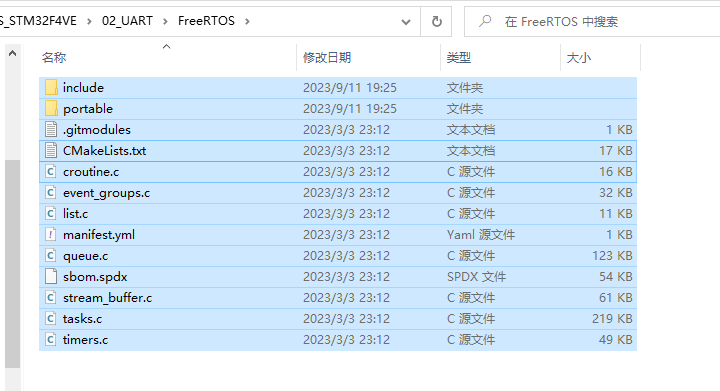

**3.Copy configurations related to STM32F4 which is located at `FreeRTOSv202212.01\FreeRTOS\Demo\CORTEX_M4F_STM32F407ZG-SK` to current `include` directory**

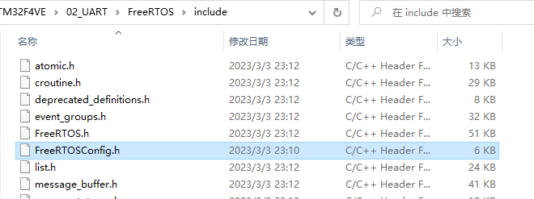

**4.Remove the files in folder `FreeRTOS/protable`, and keep only `Keil`/`MemMang`/`RVDS`**

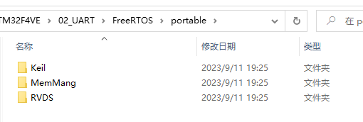


## Update demo project

**1.Create a new group named FreeRTOS_core, add the required source files.**

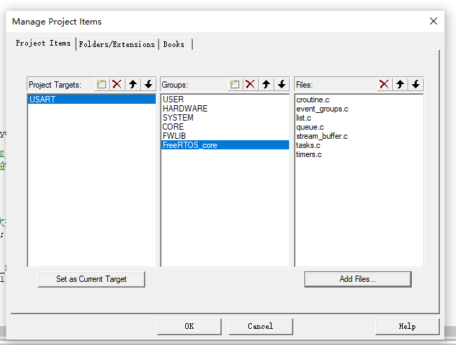

The following figure shows more details

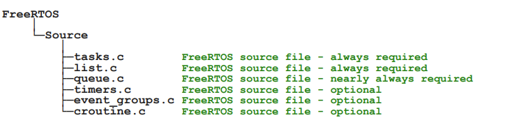

**2.Create a new group named FreeRTOS_portable, which contains the memory management method and compiling rule**

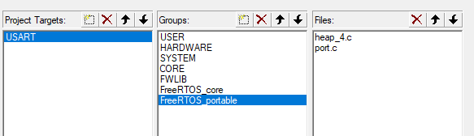

**3.Add the include files, three paths**

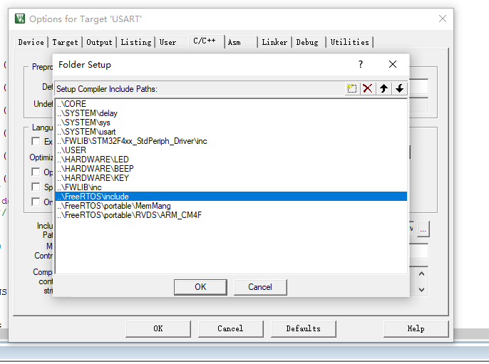

**4.Rebuild project**

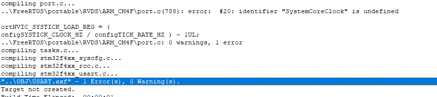

**As the figure shows, a error occurs.** 

Open file `FreeRTOSConfig.h`, make the following modifications

```c
#ifdef __ICCARM__  //delete
#if defined(__ICCARM__) || defined(__CC_ARM)  //replace
```

**Then rebuild project again, multiply defined occurs.**

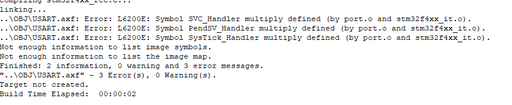

Open the file `stm32f4xx_it.c`, comment out the functions that are defined repeatedly. Open file `FreeRTOSConfig.h` meanwhile, disable the hook function following:

```c
#define configUSE_IDLE_HOOK				0
#define configUSE_TICK_HOOK				0
#define configCHECK_FOR_STACK_OVERFLOW	0
#define configUSE_MALLOC_FAILED_HOOK	0
```

This demo project should be rebuild without any errors or warnings after finishing this


## Addition

**In most cases, basic function such as USART and time_delay is needy.**

Therefore some modification should be taken in file `sys.h` to support OS.

```c
#define SYSTEM_SUPPORT_UCOS		1	
```

Then here comes two subitem:

- `usart.c`
- `delay.c`

---

-1- `usart.c`

```c
#if SYSTEM_SUPPORT_UCOS
#include "FreeRTOS.h"
#endif

/* There’s no need to use `OSIntEnter/OSIntExit` when using FreeRTOS */
void USART1_IRQHandler(void)
{

//#ifdef OS_TICKS_PER_SE
//	OSIntEnter();    
//#endif
    ...
//#ifdef OS_TICKS_PER_SEC
//	OSIntExit();  											 
//#endif

}
```

-2- `delay.c`

```c
#include "delay.h"
#include "sys.h"

#if SYSTEM_SUPPORT_UCOS
#include "FreeRTOS.h"  
#include "task.h"
#define OS_CRITICAL_METHOD
#endif

static u8  fac_us=0;
static u16 fac_ms=0;

#ifdef OS_CRITICAL_METHOD

extern void xPortSysTickHandler(void); 
void SysTick_Handler(void)
{				   
	if(xTaskGetSchedulerState()!=taskSCHEDULER_NOT_STARTED) /* System had been run */
    {
        xPortSysTickHandler();  
    }
}

#endif
			   
void delay_init(u8 SYSCLK)
{
#ifdef OS_CRITICAL_METHOD
	u32 reload;
#endif
 	SysTick_CLKSourceConfig(SysTick_CLKSource_HCLK_Div8);
	fac_us=SYSCLK/8;
	    
#ifdef OS_CRITICAL_METHOD
	reload=SYSCLK/8;
	reload*=1000000/configTICK_RATE_HZ; /* time slice = 1,000,000ms / configTICK_RATE_HZ  */

	fac_ms=1000/configTICK_RATE_HZ;  
	SysTick->CTRL|=SysTick_CTRL_TICKINT_Msk;
	SysTick->LOAD=reload;
	SysTick->CTRL|=SysTick_CTRL_ENABLE_Msk;
#else
	fac_ms=(u16)fac_us*1000;
#endif
}								    

#ifdef OS_CRITICAL_METHOD
	    								   
void delay_us(u32 nus)
{		
	u32 ticks;
	u32 told,tnow,tcnt=0;
	u32 reload=SysTick->LOAD;  	 
	ticks=nus*fac_us;		 
	tcnt=0;
//	OSSchedLock();
	told=SysTick->VAL;
	while(1)
	{
		tnow=SysTick->VAL;	
		if(tnow!=told)
		{	    
			if(tnow<told)tcnt+=told-tnow;
			else tcnt+=reload-tnow+told;	    
			told=tnow;
			if(tcnt>=ticks)break;
		}  
	};
//	OSSchedUnlock();							    
}

void delay_ms(u16 nms)
{	
		if(xTaskGetSchedulerState()!=taskSCHEDULER_NOT_STARTED)
	{		  
		if(nms>=fac_ms)
		{
   			vTaskDelay(nms/fac_ms);
		}
		nms%=fac_ms; 
	}
	delay_us((u32)(nms*1000));
}
```

Comment out the repeating `SysTick_Handler()` in file `FreeRTOSConfig.h`

---


## Example demo

> About source code, please ref to 02_USART on current folder

The output produced when 02_USART is executed as following figure:

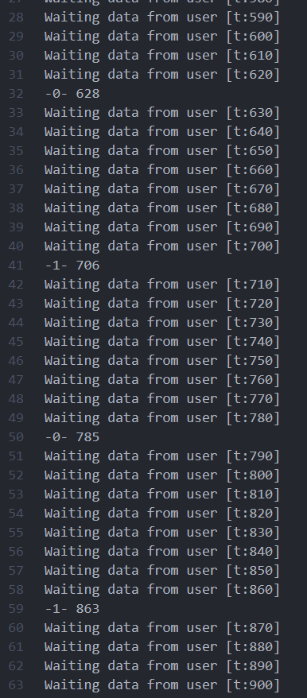

As the picture shows, time period between `-0-` and `-1-` is about 80. Some related source code as follows:

```c
static u16 times = 0;
void task_0(void *param)
{
	u8 i, len;	

	for ( ;; ) {
		if (USART_RX_STA & 0x8000) { /* Data have came from the serial port */
			len = USART_RX_STA & 0x3fff;
			printf("\r\nInput:\r\n");

			for (i = 0; i < len; i++) {
				USART_SendData(USART1, USART_RX_BUF[i]);
				while(USART_GetFlagStatus(USART1, USART_FLAG_TC)!=SET);
			}
			printf("\r\n\r\n");
			USART_RX_STA=0;
		} else { /* nothing from the serial port */
			times++;
			if (0 == times % 10) {
				printf("Waiting data from user [t:%d]\r\n", times); 
			}
			delay_ms(10);
		}
	}

	// vTaskDelete(NULL);
}

void task_1(void *param)
{
	for ( ;; ) {
		GPIO_ResetBits(GPIOA,GPIO_Pin_7);
		printf("-0- %d\r\n", times);
		delay_ms(800);
		GPIO_SetBits(GPIOA,GPIO_Pin_7);
		printf("-1- %d\r\n", times);
		delay_ms(800);

		if (0 == times % 30) {
			printf("Time flies %d\r\n", times);
		}
	}

	// vTaskDelete(NULL);
}
```

As the `time slice` of FreeRTOS is set to 1000HZ, the delay function runs as expected.


